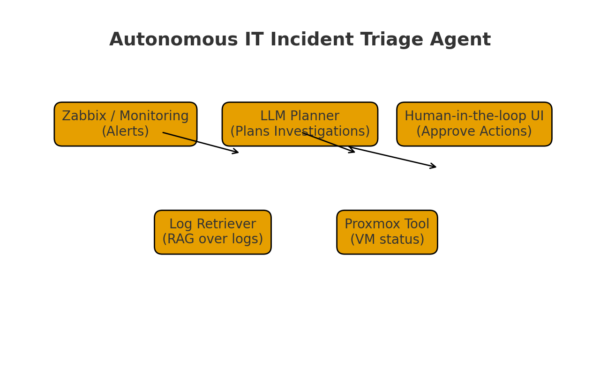

# Autonomous IT Incident Triage & Remediation Agent  
Capstone Project • Kaggle Agents Intensive  
Track: **Business & Productivity Agents**

---

<p align="center">
  
</p>

---

# 📌 Project Overview

Modern IT infrastructures generate thousands of alerts and log events daily.  
Manually triaging every alert is slow, error-prone, and requires skilled engineers.

This project proposes an **Autonomous Incident Triage & Remediation Agent** that processes system alerts, analyzes logs, checks server metrics, diagnoses the issue, and recommends — or performs — automated remediation steps.

It is fully aligned with Kaggle’s Agents Intensive Capstone requirements, demonstrating:

- Tool calling  
- Multi-step agent planning  
- RAG over logs  
- Modular agent architecture  
- AI-powered reasoning  
- Clear documentation & maintainability  

---

# 🎯 Problem Statement

IT operations teams face challenges:

- Too many alerts from monitoring systems  
- Logs are unclear or spread across systems  
- Diagnosing root cause requires manual log analysis  
- Triage takes time and delays recovery  
- Repetitive tasks waste engineer productivity  

This leads to **increased downtime**, **higher operational cost**, and **alert fatigue**.

---

# 🤖 Solution Statement

The **Autonomous Incident Triage Agent** solves these challenges by:

### ✔ Reading alerts  
Extracts key fields: service, severity, time, context.

### ✔ Performing RAG on logs  
Searches log snippets related to the alert.

### ✔ Fetching system metrics  
Queries CPU, RAM, Disk, Network, Service state  
(Mocked Proxmox/VM APIs included)

### ✔ LLM-based root cause analysis  
The agent reasons over:

- Logs  
- Metrics  
- Historical patterns  

And generates:

- Diagnosis  
- Explanation  
- Possible remediation  

### ✔ Optional auto-remediation  
Simulated actions include:

- Restarting services  
- Clearing cache  
- Regenerating config  
- Rebooting VM  

### ✔ Generates a Markdown incident report  
Includes alert summary, logs, metrics, root cause, and recommended actions.

---

# 🏗️ Architecture

<p align="center">
  
</p>

<p align="center">
  
</p>

### **Components:**
- **Alert Parser** – receives the incident  
- **Log Tool** – provides RAG snippets  
- **Metrics Tool** – fetches system health  
- **LLM Reasoner** – diagnoses & recommends  
- **Action Tool** – performs safe actions  
- **Planner** – multi-step workflow orchestration  
- **Reporter** – builds the final report  

---

# ✍️ Content Strategist

This project communicates:

- High business value  
- Technical clarity  
- Strong use of AI agents  
- Realistic enterprise IT use-case  

It is crafted for both **Kaggle judges** and **engineering teams**.

---

# 🧾 Technical Writer

Documentation includes:

- Clear problem framing  
- Step-by-step architecture explanation  
- Code structure  
- Setup instructions  
- Diagrams & images  
- Example workflow  

---

# 🔧 Essential Tools & Utilities

| Tool / Module | Purpose |
|---------------|---------|
| **log_tool.py** | Provide log context + RAG |
| **metrics_tool.py** | Fetch system metrics |
| **action_tool.py** | Perform simulated remediation |
| **planner.py** | Multi-step workflow |
| **executor.py** | Main agent runner |
| **llm_client_mock.py** | No-API demo reasoning |
| **llm_client_gemini.py** | Gemini integration template |
| **sample_data.py** | Demo alerts + logs |

---

# 💡 Value Statement

The agent delivers:

- Faster incident response  
- Reduced downtime  
- Automated triage  
- Actionable root cause summaries  
- Lower operational load on IT teams  

In enterprise operations, even a **5-minute faster diagnosis** saves thousands of dollars.

---

# 📁 Project Structure

```

agents-capstone/
│
├── README.md
├── requirements.txt
├── kaggle_notebook.ipynb
│
├── assets/
│   ├── thumbnail.png
│   ├── architecture.png
│   └── flow_adk_web.png
│
├── data/
│   ├── sample_alerts.json
│   └── sample_logs.txt
│
├── src/
│   ├── agent/
│   │   ├── planner.py
│   │   └── executor.py
│   │
│   ├── tools/
│   │   ├── log_tool.py
│   │   ├── metrics_tool.py
│   │   └── action_tool.py
│   │
│   ├── llm/
│   │   ├── llm_client_mock.py
│   │   └── llm_client_gemini.py
│   │
│   └── utils/
│       └── sample_data.py
│
└── tests/
└── test_tools.py

````

---

# ⚙️ Installation

```bash
git clone https://github.com/<your-username>/agents-capstone.git
cd agents-capstone
pip install -r requirements.txt
````

---

# ▶️ Running the Workflow

### **Run main agent**

```bash
python src/agent/executor.py
```

### **Run Kaggle Notebook**

Open:

```
kaggle_notebook.ipynb
```

---

# 🔄 Workflow Summary

1. Alert received
2. Logs fetched (RAG)
3. Metrics fetched
4. LLM analyses + diagnosis
5. Optional auto-remediation
6. Final report generated

---

# 🏁 Conclusion

This project demonstrates a **complete agent system** following the Kaggle Agents Intensive curriculum, providing:

* Real-world IT automation
* Strong architecture
* Multi-step reasoning
* Clean codebase
* Deployment-ready patterns
* High-quality documentation


