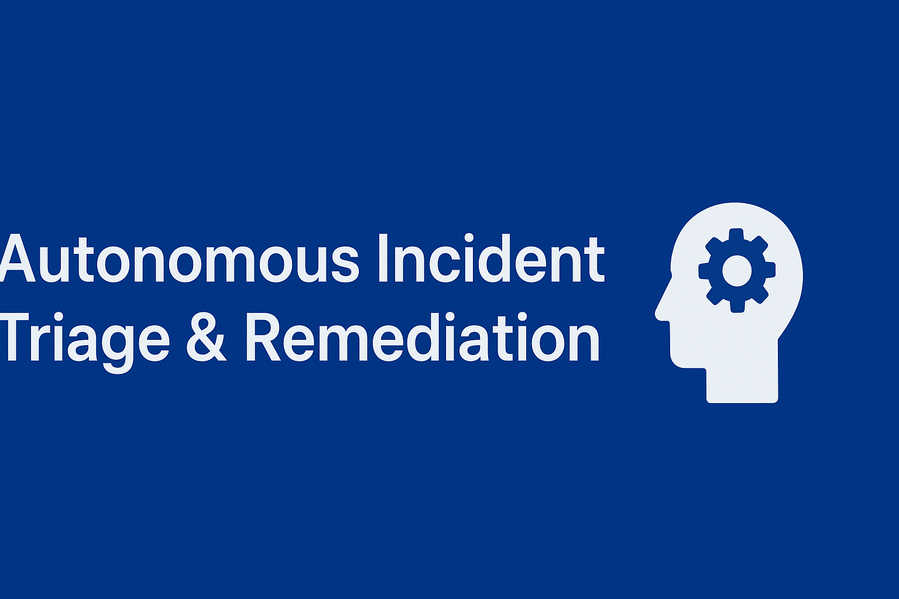

# 🚀 Autonomous Threat Detection & Response Agent (ATD-Agent)



## 📌 Project Overview

The **Autonomous Threat Detection & Response Agent (ATD-Agent)** is an AI-driven security automation system designed for small labs, homelabs, and enterprise testbeds. The project empowers security engineers to **detect, analyze, and respond to unknown network threats** using LLM-powered agents, automated workflows, and modular plugins.

This system is ideal for environments involving **Proxmox, OPNsense, virtual labs, Wi-Fi research, honeypots, or enterprise network simulations.**

---

# 🎯 Problem Statement

Modern network environments—including homelabs—frequently encounter:

* Unknown inbound traffic
* Port scans, brute-force attempts, malware callbacks
* Lateral movement inside LAN/SDN
* Misconfiguration-based vulnerabilities
* Lack of real-time, automated analysis

Traditional tools such as firewalls and SIEMs **alert**, but they do not **intelligently analyze or autonomously act** without manual intervention.

---

# 💡 Solution Statement

ATD-Agent introduces an **autonomous, multi-agent AI system** that:

* Monitors inbound logs/traffic from OPNsense, Proxmox, or Linux hosts
* Detects anomalies using LLM-enhanced reasoning
* Automatically investigates unknown behaviors
* Suggests or executes mitigation actions
* Summarizes incidents into professional SOC-style reports

The system integrates seamlessly with CLI tools, third-party APIs, honeypots, and alerting channels such as email, Discord, or Telegram.

---

# 🧱 Architecture

The project uses a structured, agent-based approach with integrated toolchains.

```
                   ┌──────────────────────────┐
                   │  OPNsense / Firewall      │
                   │  Logs / Alerts / Events   │
                   └─────────────┬─────────────┘
                                 │
                                 ▼
                     flow_adk_web.png (your diagram)
                                 │
                                 ▼
             ┌────────────────────────────────────────┐
             │         ATD Agent Controller           │
             │  - Task Scheduler                      │
             │  - Incident Orchestrator               │
             │  - Tool Manager                        │
             └───────────────┬────────────────────────┘
                             │
    ┌────────────────────────┼──────────────────────────┐
    ▼                        ▼                          ▼
Detection Agent      Investigation Agent      Action/Response Agent
- Traffic patterns   - Forensic analysis      - Firewall updates  
- Anomaly scoring    - CVE lookup             - Network isolation  
- Log parsing        - Behavior mapping       - Alerting mechanisms  
```


---

# 🧩 Content Strategist

This project includes curated content development for:

* Threat-analysis reporting
* SOC-level incident summaries
* Documentation generation via LLM
* Structured JSON outputs for dashboards

---

# ✍️ Technical Writer

The system auto-generates:

* Incident summaries
* Threat intelligence briefs
* Markdown technical reports
* Automated changelogs

---

# 🛠 Essential Tools and Utilities

The project integrates with:

* **Python** (core orchestrator)
* **LLM APIs** (OpenAI / local models)
* **Log parsing modules**
* **Network CLI Tools** (nmap, tcpdump, ufw/pf)
* **Alerting Services** (Telegram/Discord/email)
* **Visualization Tools** (for future Grafana dashboards)

---

# 🗂 Project Structure

```
agents-capstone/
│
├── agents/
│   ├── detection_agent.py
│   ├── investigation_agent.py
│   ├── response_agent.py
│
├── tools/
│   ├── log_parser.py
│   ├── firewall_manager.py
│   ├── threat_intel.py
│
├── data/
│   ├── samples/
│
├── configs/
│   └── settings.yaml
│
├── flow_adk_web.png
├── thumbnail.png
└── README.md
```

---

# ⚙️ Installation

### **1. Clone the repository**

```bash
git clone https://github.com/<your-username>/agents-capstone.git
cd agents-capstone
```

### **2. Create a virtual environment**

```bash
python3 -m venv venv
source venv/bin/activate  # Linux / macOS
venv\Scripts\activate     # Windows
```

### **3. Install dependencies**

```bash
pip install -r requirements.txt
```

### **4. Configure API keys & Settings**

Edit the configuration file:

```
configs/settings.yaml
```

Add your:

* OpenAI API key
* Logging paths
* Notification settings
* Firewall mode (dry-run or live)

---

# 🔄 Workflow

1. Logs or firewall events are fed into the system
2. Detection Agent identifies anomalies
3. Investigation Agent performs extended threat analysis
4. Response Agent takes safe automated actions (optional)
5. A SOC-style report is generated

---

# 📌 Value Statement

This project provides a **fully autonomous AI security analyst** that reduces manual workload by:

* Automating threat detection
* Streamlining investigation
* Producing professional-grade reports
* Optionally enforcing protective actions

It is a **powerful, modern, AI-enhanced SOC system** designed for both homelabs and enterprise sandboxes.

---

# 🏁 Conclusion

The Autonomous Threat Detection & Response Agent is your intelligent security companion—capable of analyzing, reporting, and responding to threats in real time.

